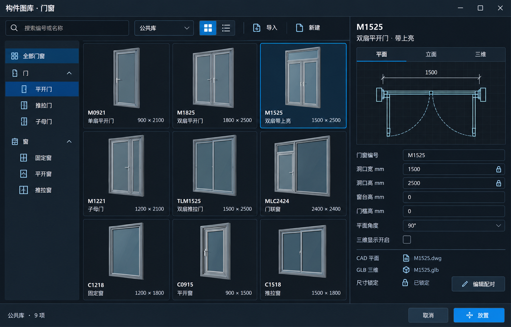
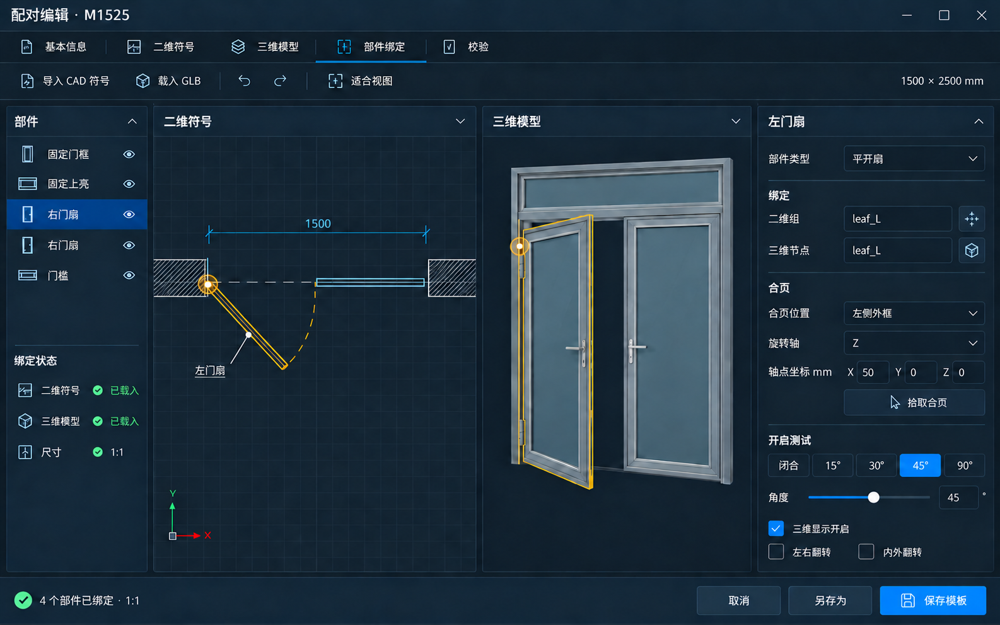

# 构件图库与配对编辑设计

日期：2026-10-05。图库和配对布局已确认；参数图库开始实现，外部 CAD/GLB 配对尚未接通。

## 已选定：图库主界面

用户明确选择本轮第二张显示的方案，对应 `library-grid.png`。

- 左侧分类、中间缩略图网格、右侧预览与插入参数。
- 网格/列表切换，来源筛选、搜索，导入和新建使用统一图标。
- MM 为门窗放置入口，右侧预览可切换平面、立面和三维。
- 控件、边线、间距及视觉层级以本图为目标，不另换列表或双预览主布局。
- 本图中的门窗图例是生成示意，不作资源数据；实际用 CAD 矢量和三维资产，门联窗不能用普通推拉门代替。资源源文件展示不意味着独立程序直接读取 DWG/MAX。

## 已确认：配对编辑窗口

`pairing-editor-draft.png` 为第二张图库方案的配套编辑稿。

- 顶部紧凑页签/工具条；左侧部件树；中间二维 CAD 平面和三维模型并排；右侧绑定、合页和开启测试属性；底部保存模板。
- 二维预览必须是真正的俯视符号，不能用透视门替代。可动扇、固定框、合页和门槛分开绑定，修改扇运动不得转动固定框。
- 用户确认此布局并要求修正文字：部件树第三行选中项应为“左门扇”，与右侧标题、leaf_L、二维选择及三维高亮一致。原生成稿仍显示误写的“右门扇”，实现不得照搬该错误。
- 门槛为可选部件，示例绑定状态的数量须由实际绑定数据计算，不能硬编码图中的“4 个部件已绑定”。
- 示例预览用于布局确认，不是 CAD/GLB 可用资源，更不是实机操作或几何验收结果。

## 来源与生成

采用内置图像生成工具；图库参考现有 MM 与门窗分格编辑器截图。配对窗口参考用户选定的第二张图库及实际 M1525 分格窗口。

提示内容：单一 Windows 工程工具窗口、紧凑暗色工作面、统一线性图标、真实门窗缩略图、尺寸锁定与插入参数；配对页增加二维/三维联动、外侧合页、节点绑定、角度测试和明确保存操作。配对图迭代将二维栏的透视门替换为俯视 CAD 平面，并尝试纠正选中项标签；后者未成功，已明确记录。

其他方向 `library-list.png`、`library-dual-preview.png` 仅保留为未选方案，不能误用作当前主界面实现目标。

实施范围与资源安全、版本、尺寸规则见 [开发方案](../../plans/构件图库-CAD与3dsMax门窗配对-2026-10-05.md)。首批参数图库支持公共库与资源包，不把此阶段称为完整 CAD/MAX 配对实现；安装和测试状态见当日交接摘要。未上传 GitHub。
