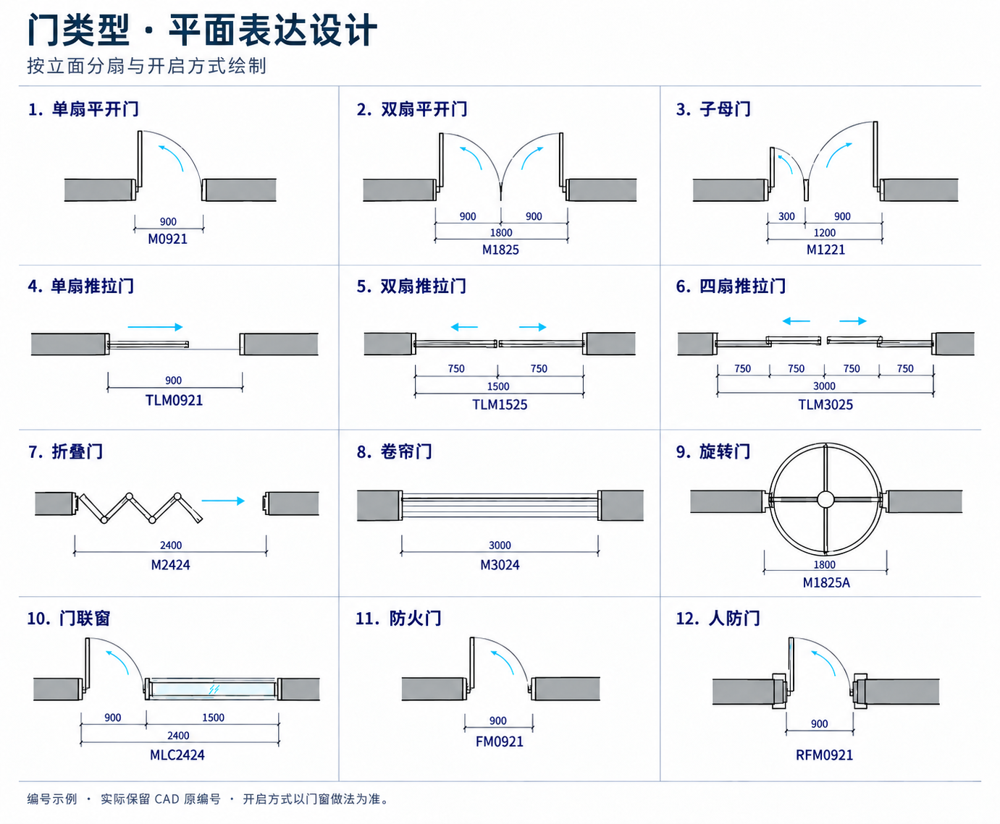
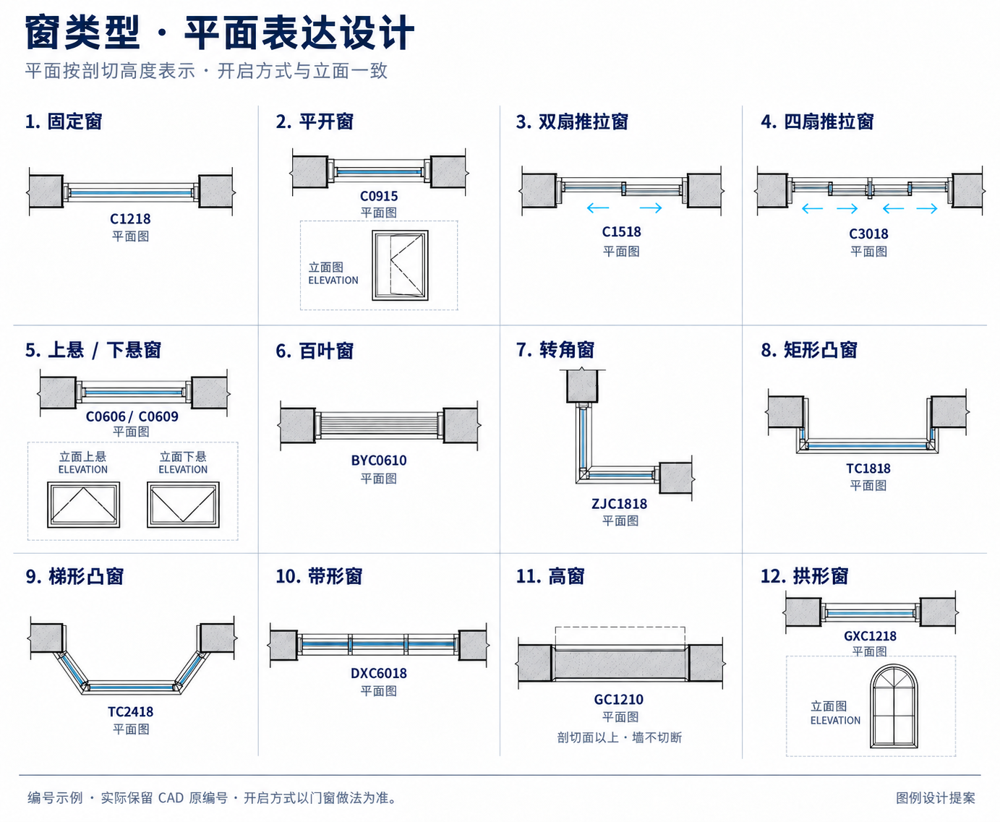
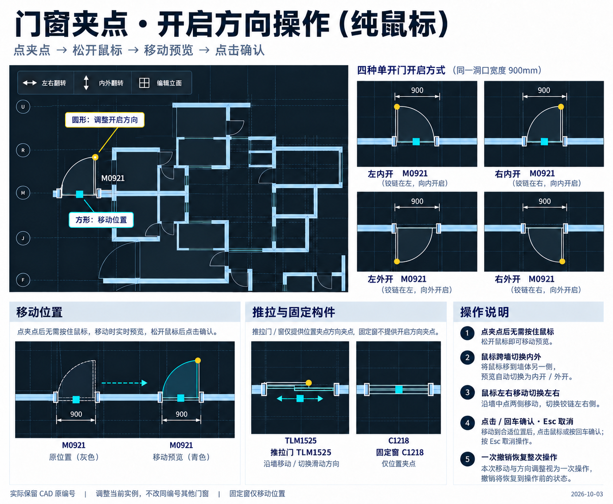

# 门窗平面图例与纯鼠标夹点设计

设计日期：2026-10-03。用户已确认图例及纯鼠标交互，2026-10-04 已实现平面图例、编号、类型字段与夹点，并完成自动及实际窗口自测。用户本轮关闭确认后已覆盖原安装目录，版本保持 1.5.6，文件哈希及安装版窗口自测通过；本次没有上传 GitHub。

## 已确认的要求

- 每种门窗显示完整编号，保留来自天正/CAD 的原编号，编号作为识别及关联依据。
- 开启方向不要求 Shift。进入方向操作后，鼠标左右移动切换左右，跨墙移动切换内外。
- 先设计各类平面图例，再实现；不能继续把所有门画成整宽单扇弧。

## 设计图

这三张是同一方案的不同部分，不是三种互斥的界面方案。采用最后修订稿，早期生成稿不作为实现基准。

图内编号、尺寸为演示项目数据，不强制重编实际项目编号，不代表通用编号标准。白底用于图例校对，软件内仍沿用现有深色视口及图层样式。

## 图例范围与几何约束

| 门类型 | 示例编号 | 平面约束 |
| --- | --- | --- |
| 单扇平开 | M0921 | 扇线与开启弧共用同一铰链点，半径等于本扇宽 |
| 双扇平开 | M1825 | 两扇各有铰链与开启弧，不能画 1800 mm 整宽弧 |
| 子母门 | M1221 | 大小扇宽来自立面分格，分别画弧 |
| 单扇推拉 | TLM0921 | 沿墙平移，明确移动扇、轨道及开启方向 |
| 双扇推拉 | TLM1525 | 示例整宽 1500 mm，名义分格 750 + 750；真实框扇及搭接读取做法 |
| 四扇推拉 | TLM3025 | 四格、轨道错位及搭接来自做法，不能套平开弧 |
| 折叠门 | M2424 | 铰接扇折线与实际扇数对应，不用整宽开启弧 |
| 卷帘门 | M3024 | 洞口内帘界线，不把卷筒剖面画到平面上 |
| 旋转门 | M1825A | 圆形围护及径向翼片，旋转轴和半径来自类型参数 |
| 门联窗 | MLC2424 | 门、窗区按立面拆分，门弧仅使用门区宽度 |
| 防火门 | FM0921 | 开启几何遵循实际门扇，防火等级是独立属性 |
| 人防门 | RFM0921 | 门扇、门框做法独立，不能靠功能名称推导整宽开启弧 |

窗图覆盖固定、平开、双/四扇推拉、上/下悬、百叶、转角、矩形/梯形凸窗、带形、高窗及拱形。防火窗沿用其实际窗型平面，等级另存属性。百叶门同理：材料与门扇开启方式分开，不能把百叶材质当作开启方式。

- 平面按实际剖切高度表示。窗台高于剖切面时墙体不切断，允许投影虚线；低窗和落地窗按切面与构造表示。
- 上/下悬及拱形的辅助小图是立面解释，不是新增平面开启弧。矩形凸窗侧边必须垂直，梯形凸窗侧边才可倾斜。
- 扇宽、框料、安装缝与搭接读取保存的立面/构造数据。图例尺寸与方向箭头仅用于校对，实际出图的尺寸和提示须由相应显示设置控制。
- 2026-10-04 框扇接头修正：扇宽采用扣除固定框和扇缝的净宽，不再使用洞口整宽。平开轮廓、弧、方向点和拾取扇形采用同一避框铰接位置；推拉搭接只读取一次，无固定中梃时保留合法搭接，有固定框时不穿框。模型平面细线固定为 1 个逻辑像素，不随放大增粗；真实洞口、三维构造和 CAD 图层线宽不变。放大运行截图见 `docs/reviews/门窗平面框扇分离-2026-10-04.md`。
- 折叠、卷帘、旋转等扩展类型列入本次设计，不表示当前程序已具有完整类型参数和三维构造；实施时先补类型数据，再接平面符号。

## 编号显示与识别

- 编号文本保留原始内容、前缀、数字及后缀；内部比较允许规范化，但显示不擅自重命名。未知编号也要保留，不丢弃门窗。
- 编号用于关联门窗表和类型做法。同编号的多樘对象仍须以源对象身份及模型实例 ID 区分，不能把编号当成单樘唯一 ID。
- 显式对象类型、已保存分格与开启方式优先于前缀猜测。普通 M/C 编号也可能采用推拉、固定或其他做法，不从编号单独猜出全部几何。
- 编号与尺寸、源对象类型冲突时提示核对，不偷偷修改洞口宽高；不能默认所有编号的四位数字都是可靠尺寸。
- 识别文字必须与其源门窗对象或可靠几何范围关联，不能按最近文字随机配对。文字高度、宽度因子沿用已有注释配置，并作最小避让。

## 纯鼠标交互

1. 选中门窗后，方形位置夹点位于洞口中点；可调整方向的构件显示圆形方向夹点。平开门方向点放在扇自由端，不另造远离门扇的方向点。
2. 点夹点并松开鼠标进入操作，移动鼠标连续预览，再点击或回车确认，Esc 取消。不得要求持续按住鼠标；拖拽兼容可另行提供，但不是唯一入口。
3. 位置模式只移动位置，不改变方向或宽高；沿宿主墙移动，并允许切换同层有效宿主墙。
4. 平开方向模式以洞口中点和墙局部轴向划分左右，墙两侧划分内外。鼠标移动到相应区域即切换四种状态，不使用 Shift，不改变洞口位置。
5. 坐标分区跟随斜墙及视图方向，不能硬套屏幕水平/垂直。中线附近采用小死区，保留上一状态，避免抖动；死区只影响交互判定，不改模型真实坐标。
6. 推拉的方向点调整滑动方向及有效轨道侧，不套用平开铰链逻辑；固定窗只提供位置操作。上/下悬等不适用水平四象限的构件，开启方式在做法编辑内修改。
7. 每次操作仅作用于当前实例，不改变同编号其他对象。对称构件翻转后完全相同的状态不产生无意义历史。
8. 预览不写模型、不逐帧重建三维。确认时验证宿主、范围、重叠及高度，原子提交；一次撤销恢复整笔，失去捕获或切换编辑上下文取消草稿。

## 参考与验收

[天正官方产品介绍](https://tangent.com.cn/tzt30jz)确认其专业对象可通过夹点、对象编辑及特性表修改。具体鼠标分区、点击确认及死区规则是本项目的设计提案，不冒充天正某个版本已核实的精确按键映射。

- 图例验证按各类保存的立面分格、实际洞口宽高、扇数、铰链位置及滑动轨道逐项比对；不只看截图外观。
- 交互验证四种平开状态、斜墙、内外/左右中线、点击松开操作、取消、保存、一次撤销、同编号多实例及标准层。
- 输出验证所有编号可见、文字不与门弧和尺寸相撞，平面编辑、图纸预览和 CAD 落图保持同一类型/方向数据。
- 保留原有局部缓存及提交后刷新策略，验证密集门窗模型的移动性能；生成设计图不等同于程序性能或实机验收通过。

## 实现范围

2026-10-05 图纸细节补充：平开补扇区内的弧形方向箭头，卷帘补卷轴和方向箭头，旋转门补旋转箭头；实例角度与镜像同步。图纸增加 CAD 毫米线宽设置、连续路径转角及接墙楼板线裁剪。用户后续确认墙交接对角线不在图纸显示，仅平面编辑保留；原有门窗开启线不受影响。开启弧目前采用 64 段精细线段，不声称是 CAD 原生 ARC。实际截图与边界见 `docs/reviews/图纸线宽与转角及门窗细节-2026-10-05.md`。

2026-10-04 后续补充：平开门的平面角度按实例提供 90°、45°、30°、15°预设及 0～180°自定义输入；开启弧、门扇、方向夹点和拾取扇形同步。三维新增构件默认闭合，以实例开关显示相同角度的开启，保留旧类型的显式三维角度。属性栏允许修改门窗编号；新编号保留原立面分格和实例覆盖做法，人工编号、角度和开关随重新登记保留。实际运行截图及验证边界见 `docs/reviews/门窗开启角度与编号编辑-2026-10-04.md`。旧设计图固定 90°不再作为唯一开启状态要求。

2026-10-04 用户补充：编号贴近洞口且允许压住开启符号，新增编号移动夹点；夹点放大且拖动松手直接提交；门扇、开启弧及洞口参与拾取，并增加悬停预选；移动显示洞口边到最近墙端的净距并支持数字输入。旧图稿中远离洞口的编号与需补按回车的交互不再作为实现要求。这些补充已于当日 14:19 覆盖原目录，保持 1.5.6；文件校验及安装版大小窗口、图纸回归通过。自测记录见 `docs/reviews/门窗编号拾取与墙端净距-2026-10-04.md`，原有类型及立面联动不变。

- 普通、组合与推拉构件沿用同一立面分格及物理构造，读取框料、面板厚度与轨道搭接。固定、平开窗、上/下悬和拱形窗在平面不额外画门式开启弧。
- 做法编辑的“门窗类型与整体设置”新增“平面形式”，提供按立面、折叠门、卷帘门、旋转门、矩形凸窗、梯形凸窗和转角窗；梯形的收进量单独输入。现有分格编辑负责实际扇数和扇宽，原编号不被这些选项重命名。
- 高窗保留完整墙线，以墙侧投影虚线表示；平面编辑、图纸及 CAD 输出使用同一图例生成器。
- 选中实例后，视口左上角显示相连的“左右翻转 / 内外翻转 / 编辑立面”工具条。固定构件的方向命令禁用；位置和方向夹点采用点击、松开、移动、再次点击的主流程，同时保留拖动兼容。
- 折叠、卷帘、旋转与转角/梯形凸窗的本轮新增内容是平面类型及符号，不声称已经完成这些类型的专用三维机械构造和跨墙宿主联动。
- 运行截图和已测试/未测试边界见 `docs/reviews/门窗图例与纯鼠标夹点自测-2026-10-04.md`。
