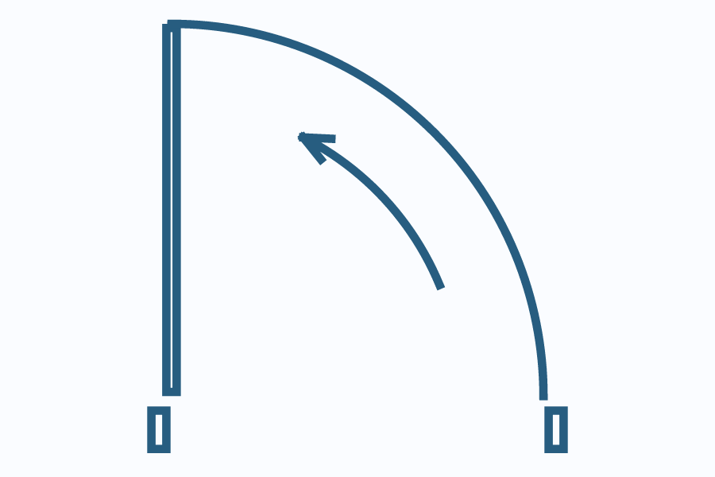
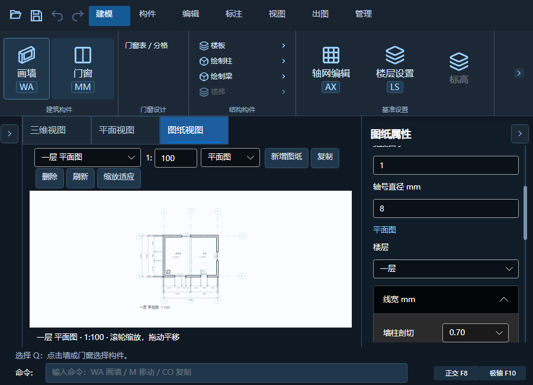
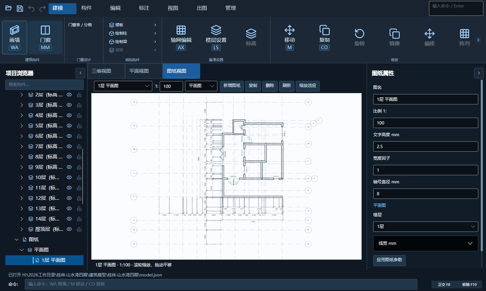
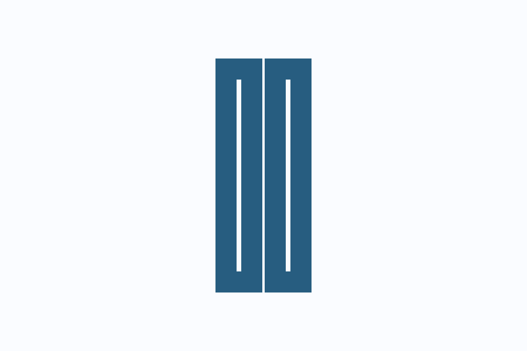

# 图纸线宽、转角与门窗细节

日期：2026-10-05。对应用户反馈：补齐设计图中的开启箭头、CAD 毫米线宽设置、转角缺口、墙边楼板重复线。后续用户确认墙交接处的对角线不在图纸显示，仅平面编辑保留；此前“恢复细斜接线”的理解已纠正。

## 修改

- 图纸普通线由独立线段描边改为缓存的连续矢量路径：同层、同线型、同线宽的度二端点连接，闭环闭合，分支保留，连续线采用斜接和方形端帽。缩放只变换路径，不放大位图；不桥接门窗洞口、不修改原模型坐标。
- 平开门增加扇区内的弧形方向箭头，跟随实际净扇宽、实例角度和两种翻转；卷帘增加卷轴符号与方向箭头，旋转门增加方向箭头。开启弧采用 64 段，箭头弧采用 24 段，以改善放大后的折线感；CAD 中目前仍是精细线段，不冒充原生 ARC 实体。
- 图纸投影不生成墙交接处的斜接对角辅助线；平面编辑器继续独立计算和显示这些线，三维构造不变。正交识别容差与墙体融合统一为 0.01 mm，微小浮点偏差不再漏掉编辑器斜接线；不舍入实际墙坐标，不过滤真正的斜墙或门窗线。
- 楼板边按宿主墙的实际厚度和偏心位置裁去覆盖区间。仅删除相接或被遮挡的部分，保留外露、外挑及未被墙覆盖的井道边；不删除楼板实体，也不更改三维几何。
- 图纸属性新增折叠的“线宽 mm”，采用 CAD 标准值 0.00～2.11 mm 的离散规格，默认随图层，可逐图设置墙柱剖切、可见轮廓、门窗、楼板、轴线、尺寸等。0.00 采用屏幕发丝线，不代表隐藏。预览不提前保存；应用形成一次事务，取消及撤销恢复。
- 明确设置的线宽随每个输出图元保存，纸面及模型空间排版均保留不同视图的设置。CAD 实体使用对应 LineWeight，尺寸线与界线同步；默认仍为 ByLayer，不改项目已有的统一图层规范。建筑落图依然是真实毫米 1:1。

## 验证

- 核心套件及 CAD 登记套件通过。新增测试覆盖合法/非法 CAD 线宽、发丝线、保存、原子撤销、混合视图排版、线宽不改变几何、楼板局部接墙裁线和偏心墙、微偏墙编辑斜接。后续追加 L/T 交接投影无对角线、带门窗 T 形交接、编辑辅助线仍保留，以及真实斜墙轮廓不能误删的回归。
- 实际 Avalonia 窗口 900×650、1500×900：线宽预览/保存/撤销、比例、所有图纸类型、下拉框边界及滚动，通过。默认控件最小高度为 32 px，测试等待展开动画结束，不将动画中的临时尺寸误判为裁切。
- 像素检查通过：两种缩放的斜接外角没有缺口，0.70 mm 的纸面笔宽换算正确；15/30/45/90 度门箭头截图保留。原有门窗夹点、预选、右键居中、模板及取消/撤销测试通过。
- 山水湾只读回归：15 层、138 个源门窗、285492 面；门槛输入 49.4 ms、预览 657.7 ms、应用 51.7 ms、取消 4.0 ms；方向提交 394.4 ms、移动 958.0 ms，含 10 个标准层引用。240 次指针事件 P95 0.00 ms、最大 0.99 ms；增量/全量几何等价、撤销与取消通过。这不是完整绘制帧率承诺。
- 本轮只读测试期间真实项目 SHA256 保持 `81D821A1F92AEBE28A13413AE700806AA831B1DA1DA3D5E0F8E4975B47112621`；与昨天交接的哈希不同，使用用户当前文件，不回退昨天模型。
- R24、R25 与独立模型程序编译通过。模型程序仍有现有的分析器版本和过时 Bitmap API 警告。CAD 实机落图、打印和多显示器 DPI 尚未复测，不能写成已通过。

## 运行证据

## 安装

确认进程关闭后，于 2026-10-05 11:59:58 +08:00 覆盖原 `dist/WanLuoArchitectureTools/建筑模型` 与 `CadApi/R24`，版本保持 1.5.6；224 个模型文件和 24 个 R24 文件逐文件校验。备份 `.artifacts/install-backup-drawing-linework-20261005-115955`。

- R24 SHA256：`040601295A608897394ED2CF48AA9CF25061FFE30BB71520F8A15AA81F2F2D31`
- 模型运行 DLL：`86DA9A56162091935DEE63085B997F8DC30E75AB0545523F75C3C4D0D9DB8F2D`
- Core DLL：`C489892FD007A01768B50D8472AB03B4C8BEB5B1BAA82198D6ECF95D6B6CD7A0`

源码、运行证据和设计规则保留待下一次用户要求上传 GitHub；本轮不另建安装版本，不上传真实模型或内部安装备份。

## 后续纠正与待覆盖

用户随后明确交接对角线只在平面编辑保留，不在图纸显示。已删除图纸投影生成辅助对角线的步骤，保留编辑器原路径；线宽“轮廓 / 斜接”标签更正为“可见轮廓”。核心全套、900×650/1500×900 图纸检查及新增 T 形交接像素检查通过，R24/R25 与模型程序重新编译通过。

修正版仍在 `.artifacts/drawing-linework`。末次进程检查 CAD `39756`、模型 `14204` 仍运行，已请用户保存关闭；尚未覆盖本节修正版。上面的安装时间与哈希仅对应首次交付，不能当成纠正后的安装校验。

## 后续内收描边与最终覆盖

用户再次指出中心描边会扩大图面上的墙体和门窗外尺寸。本次为投影线增加可选 `StrokeAreaId`，视图携带物理内部 `StrokeAreas`；生成平面时区分墙融合闭合边界、门窗框、实际门扇、柱梁及被局部遮挡的楼板轮廓。立面/剖面的矩形轮廓也携带内部范围。显示采用双倍笔宽裁入物理内部，而不是移动几何；墙体内环采用奇偶填充，粗线进入墙身，不侵入房间。门框、门扇各自裁切，不再相互扩张填掉真实间隙。开启弧、方向箭头、轴线及尺寸线保持符号线中心描边，轴号圆圈向内加粗，填充边界也裁入内部。

投影归一化和图纸排版同步变换内部范围；每个排入视图重命名区域 ID，防止混用裁切。JSON 保存/读取保留这些可选信息，旧视图没有区域时仍能读取。重复的非融合墙洞口端线已移除，洞口两侧由真实墙段闭合轮廓表达。没有更改模型坐标、墙厚、洞口宽或三维构造。

新增像素检查覆盖 0.18/0.50/0.70 mm、两个缩放级别、外边界不膨胀、内环不侵占及门框门扇 2 mm 间隙；核心全套、CAD 登记回归、900×650 与 1500×900 图纸检查通过，山水湾模型只读截图完成。R24/R25 与模型程序编译通过，保留既有 Avalonia 分析器和过时 Bitmap.Save 警告。

边界：这是图纸视图的墨线显示规则。CAD 原生 `LineWeight` 仍为中心描边，实体坐标保持 1:1，没有用偏移 CAD 线改变可测量的尺寸；CAD 实际打印内收尚未实现或实测。本轮不宣称所有特殊门窗开放符号、楼梯/屋顶开放线段都存在实体内侧裁切。

2026-10-05 12:50:57 +08:00 确认进程关闭后，已将交接线隐藏及内收描边合并覆盖原安装目录，保持 1.5.6。校验 224 个模型文件、24 个 R24 文件；备份 `.artifacts/install-backup-drawing-inward-20261005-125054`。最终安装的哈希如下，替代前文首次交付与待覆盖状态：

- R24：`5B994D21054EB007B6F4E8F2E38BC0104F29668A60913707BCB361BF8BD6E8E4`
- 模型运行 DLL：`C6F4247D087226BDE9E916206326EE755654B749C8AA7A82FC7ECA2F49D7ADF6`
- Core DLL：`41855516CEF0CF3DA2CA67F8072BD9898821CDD8561F69352763DF3C833217A4`

源码、规范、测试与证据仍待用户要求后上传 GitHub。
