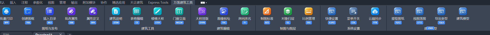

# 插件检查报告（2026-09-27）

检查版本：本地 main，99b68fa；含远端 63b0117 与建筑模型功能。此次只检查并记录，不修改生产代码、不发布。

## 范围与证据

1. Ribbon 入口：检查用户本次提供的 CAD 实际截图，并对照登记表、图标资源、快捷键标签代码。状态：有明确视觉问题。
2. 模型编辑→撤销→保存：用当前发布程序集构造主窗口，临时项目隔离复现。状态：确认模型引用不同步。
3. 模型→剖面：直接调用当前投影算法，复现墙厚内剖切遗漏。状态：确认缺陷。
4. 生成视图→CAD：审查保存、出图、落图代码。状态：存在保存失败处理问题，更新闭环尚未实现；本次未在 CAD 内真实落图。
5. 项目管理、云同步、启动器：执行现有自动测试。状态：下述测试通过，但不代表真实云盘端到端及所有 CAD 对话框已验收。

## 优先处理的问题

### 1. P1：撤销后保存、预览、出图仍使用旧模型（已复现）

- `BuildingModelStudio/PlanCanvas.cs:1213,1227` 的 Undo/Redo 将画布 `_model` 换成反序列化的新实例。
- `BuildingModelStudio/Program.cs:782` 的 StructureChanged 只刷新楼层/三维，没有同步 MainForm 的 `_model`。
- `Program.cs:898,909,1046,1066` 的保存、生成、三维及推到 CAD 继续使用主窗口旧实例。
- 复现：空模型加一面墙，记录历史，Undo；实际输出 `canvasWalls=0 formWalls=1 savedWalls=1 sameReference=False`。
- 影响：屏幕里已经撤销的构件仍被保存；撤销后的后续画布编辑也可能没有进入主窗口保存和出图状态。
- 建议：模型状态有唯一来源，画布替换快照时同步所有消费者；补“主窗口+画布+磁盘+出图”集成测试，不能只测试撤销栈。
- 复现程序：`.artifacts/audit-integration/Program.cs`，仅操作临时项目。

### 2. P1：墙厚内剖切漏断面（已复现）

- `Shared/BuildingModel/OrthographicProjector.cs:1187` 用墙中心线端点判断 crossesCut，未按有厚度墙体与剖切面的相交判定。
- 复现：墙从 (0,0) 到 (5000,0)，厚 200，高 3000；CutY=0 输出 4 条断面线、1 块填充，CutY=+50/-50 均为 0 条、0 块。
- 后两种仍处于墙厚内部，应产生墙断面。
- 建议：按墙体轮廓求交，补平行偏心剖切、斜墙、洞口处剖切测试。
- 复现程序：`.artifacts/building-audit-20260927/Program.cs`；本次重新运行得到上述结果。

### 3. P1：保存失败仍继续生成视图（代码确认）

- `BuildingModelStudio/Program.cs:893-910`：SaveModel 捕获异常只写日志，无成功返回值；GenerateViewsNow 随后无条件使用内存模型生成视图。
- PushToCad（1063 起）也没有先确认模型持久化成功。
- 文件被占用、目标不可写等情况下，模型文件与视图可能属于不同状态，用户却看到生成完成。
- 建议：保存返回结果，失败明确通知并阻止相关出图；输出模型修订号与视图修订号；关闭/切换模型时检查未保存状态。

### 4. P2：JZMX 快捷键标签落到分组标题附近（截图确认，代码支持定位原因）

- 截图中 JZMX 未在“建筑模型”按钮下，而在整组底部标题处。
- `BatchPdfPublisher/Shell/RibbonService.cs:223-225` 按 AutomationProperties.Name 匹配文字，再优先选面积最大的控件，没有限定只能是按钮。
- 按钮名与分组名都是“建筑模型”，存在把分组容器当目标的路径；未在实时 CAD 可视树中抓取最终 target，具体宿主控件类型仍需验证。
- 建议：用按钮身份/ID 与按钮控件类型定位；限定到当前 tab/panel，不能全 Ribbon 按同名文字及横坐标猜测。

### 5. P2：四个模型按钮全是键盘图标（截图与代码确认）

- `BatchPdfPublisher/Shell/RibbonIconAssets.cs:14-18` 只列出旧 18 个功能，遗漏 building_export/building_place_view/building_opening_types/building_open_studio。
- 29、37 行将未知功能回退到 shortcut_settings，因此新四项全部显示快捷键键盘图标。
- 建议：分别提供提取图纸、视图落图、类型库、建筑模型图标，并以真实 FeatureRegistry 为输入检测图标全覆盖。
- 现有 RibbonIconThemeTests 测旧的颜色/汉字规则，没有验证目前实际采用的图集映射，因此不会抓住此问题。

## 已存在的功能缺口和风险

### 6. P2：模型更新不会替换 CAD 中旧视图（实现缺口）

`BuildingModelCadBridge.cs:30` 的 PlaceView 每次让用户选插入点并 AppendEntity，没有持久化模型/视图归属与修订号，也没有更新旧图元逻辑。再次落图属于新增；如放到原位置，会产生重叠图元。这与“编辑模型后同步更新立面/剖面”的目标有差距。应先设计视图实例标识、更新范围、用户手工标注保护及撤销，再开放自动更新。

### 7. P2：“提取图纸”尚未形成自动建模流程（实现缺口）

TQTZ 能保存 DrawingImportDocument，但全库搜索 LoadImport 只有定义，没有建模程序调用方。Bridge 注释也明确识别属于后续 P3。现在不能理解为“选 CAD 平面就自动生成建筑模型”。入口提示应标明仅导出中间数据，导入、识别和人工确认流程需补齐。

### 8. P2：同步执行全量计算和落盘有卡顿风险（代码风险，未作大模型基准）

画布 Commit 同步通知保存；保存序列化整份模型并 Flush(true)。GenerateViewsNow/PushToCad 在界面事件内同步生成全部视图。小样例通过不代表数千构件或网络目录流畅。建议保存合并调度、后台不可变快照计算、取消及进度反馈，避免后台线程访问 CAD 数据库或 UI 控件。

### 9. P2：模型文件替换失败后降级为非原子覆盖（代码风险）

`Shared/BuildingModel/BuildingModelJson.cs:156-158` 捕获任意 IOException 后 File.Copy(overwrite:true)，该路径不再保证原子替换。进程中断或目标目录异常时可能留下不完整模型。应区分失败原因，保留旧文件和临时文件，明确报错；多实例编辑应有版本冲突检测。

### 10. UI 后续验证：窄窗口与 DPI、快捷键可读性

22 个功能固定为 76/82 DIP 宽的大按钮；RibbonPanelPlanner 的 ButtonsPerRow 并没有转化为实际多行布局，CreatePanel 仍逐个添加大按钮。窄窗口下如何折叠、折叠后快捷键是否定位正确，需要在 CAD 宿主验证。标签文字仅 8 DIP、标签高 13 DIP，截图里明显偏小；FormattedText pixelsPerDip 固定 1，需要跨显示器缩放清晰度检查。此项不宣称所有显示器均已失败。

## 本次验证结果

- 项目存储/配置/Ribbon 规划等：44 条 PASS。
- 项目同步/项目管理：10 条 PASS。
- 云同步：首次被全局同步互斥锁挡住；独立重跑 64 项通过、0 失败。未关闭实际 CAD 或强行解除锁，锁持有者未确认。
- 启动器项目管理：深色滚动条悬停/离开颜色、1001 行文件表、30 次滚动、80 次拉伸及 1/1.25/1.5/1.75/2/2.5/3 倍布局缩放测试通过。模拟布局缩放不等于已验证每台显示器和跨屏 DPI。
- 建筑模型原有逻辑测试及当前发布程序 --selftest-canvas 全部通过；新增针对性复现仍发现第 1、2 项，说明原有测试覆盖不足。
- 日志：`.artifacts/audit-ProjectStore.log`、`audit-ProjectSync.log`、`audit-CloudSync-retry.log`、`audit-launcher.log`、`audit-model.log`、`audit-canvas.log`。

未做：逐个打开全部 CAD 功能窗口、真实打印机/PDF 批量输出、真实云盘跨设备同步、CAD 真实落图/撤销、跨屏 DPI 实测。没有证据宣称整个插件“没有问题”。建议先修模型状态和出图正确性，再修 Ribbon 图标/定位，最后做这些宿主验收。

## 修复进展（同日）

用户确认后，已修复上表第 1～5 项：撤销后主窗体同步画布模型、保存失败阻止生成与推送、墙厚内偏心剖切、建筑模型四个入口独立图标、快捷键标签只选实际大按钮控件。同时删除模型写入失败时的非原子覆盖降级（第 9 项）。新增模型持久化与偏心剖切回归测试。图标预览见 `assets/2026-09-27-building-icons.png`。

第 6 项“已落 CAD 视图自动更新”、第 7 项“从提取图纸自动建模”属于尚未实现的完整功能，仍需后续设计与 CAD 内验收。第 8 项大模型性能尚未做压测；Ribbon 标签的最终显示位置仍需在用户的 AutoCAD/T20 环境确认。
