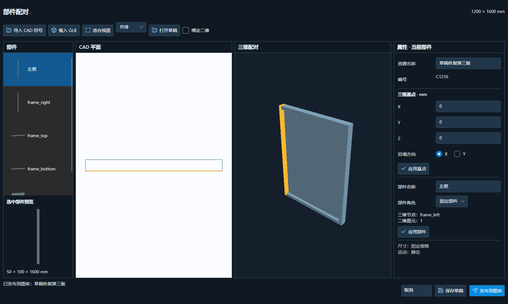
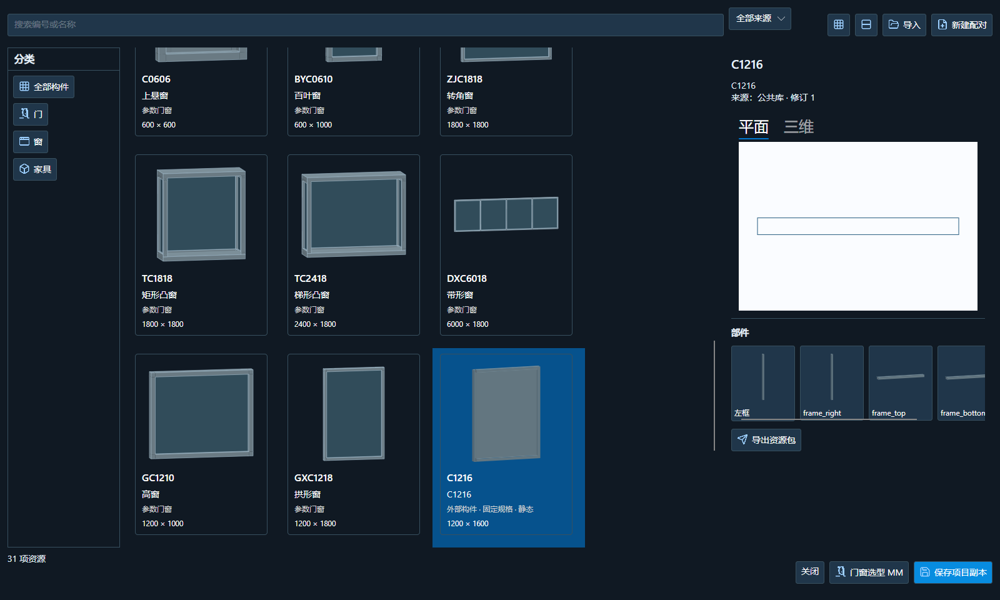
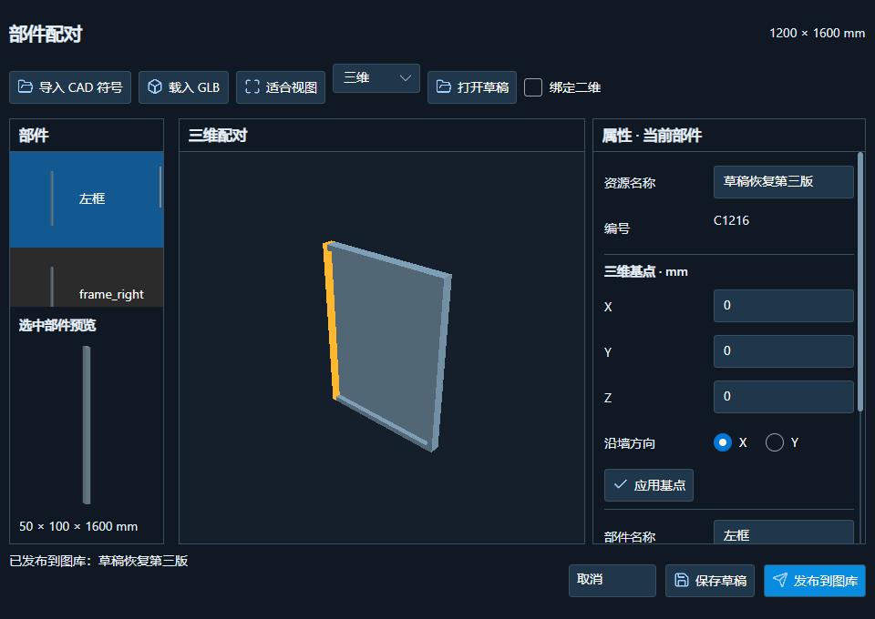

# 构件资源包与配对入库：G1 第一段

日期：2026-10-07。产品版本保持 1.5.6。用户授权开始实施、自行测试，并表示软件已关闭；本次覆盖授权取代此前“暂不覆盖”。本轮没有提交或上传 GitHub。

## 使用入口

1. CAD 功能区点“图库”，门／窗分栏填写编号、毫米洞口宽高、基点与 X/Y 方向，选择原生块后导出 `.wlplan.json`。不需要输入长命令。
2. 三维作者软件导出关闭姿态、无贴图的自包含静态 `.glb`。保留独立框、扇、五金等网格对象；本轮不直接读取 `.max`、`.blend` 或 `.skp`。
3. 建筑模型“管理 → 图库 → 新建配对”，载入 CAD 与 GLB，检查实际二维／三维；设置三维毫米基点、X/Y 方向，填写部件名称和角色。
4. 部件列表、独立预览和三维选中高亮来自实际网格，不是通用矩形占位。勾选“绑定二维”后点 CAD 线、圆、弧关联到当前部件；再次点选取消，已有其他部件占用的图元拒绝重复关联。绑定状态为高亮，原生图元仍保留在资源文件内。
5. 可保存自包含 `.wlodraft` 草稿，也可发布 `.wlopkg` 到本机公共库。草稿允许来源未齐、数值未填完，不等于可用资源。替换来源、打开其他草稿和关闭未保存窗口会提示返回／放弃／保存草稿。
6. 图库支持分类、搜索、来源筛选、网格／列表、二维／三维预览、部件预览、资源包导入导出。已保存为 `model.json` 的工程可以“保存项目副本”，复制到同目录 `components/`。

**当前是固定规格、静态资源入库，不是外部构件正式场景放置。** “保存项目副本”仅保留包，不添加模型实例、不修改工程语义 JSON；资源未提供假的放置、变尺寸或开启按钮。旧门窗继续使用 MM 插入和原有分格、编号、尺寸及开闭操作。

## 资源与兼容契约

- v1 参数包仍是单个 `manifest.json`，既有校验、生成路径与 MM 模板不改变。v2 外部包单独标记 `ExternalStatic`，严格包含 `manifest.json`、`plan.wlplan.json`、`model.glb` 三项。
- 门窗资源保存同编号／同洞口规格的参数回退；家具资源不附带门窗、墙宿主或洞口语义。增加独立家具平面 v2 契约及固定椅测试样例，不代表 CAD 家具取块窗口和家具放置已完成。
- 资源 ID、部件 ID、修订及文件哈希独立于门窗编号、节点名和来源路径。同 ID/修订不同内容不覆盖；恢复发布后的草稿继续原 ID 的下一修订；无变化重复发布不新增修订。
- CAD 与三维毫米宽高／家具进深必须匹配，三维尺寸容差 1 mm，拒绝静默整体拉伸。X/Y 基点变换为刚性坐标对准；GLB 米制 Y-up 转建筑毫米 Z-up。
- 每个三维节点只能且必须归属一个部件；二维图元绑定可选但不能重复。当前 UI 默认每个网格节点建立一个部件，尚无多个节点合并／拆分作者工具。
- 参数回退、两份源几何及绑定随包移动，不依赖作者电脑路径。项目副本逐字节保留包；搬动工程、删除本机公共库中的测试源之后仍可读取。尚未写入实例引用、实现缺资源实例回退或整栋输出接入。
- 固定尺寸／静态能力显式校验；不接受未实现的 `Rotate`、变尺寸规则，不能把尚未求解的规则当成可用发布资源。联合尺寸／动作求解仍按规划 G3 开发。
- 包上限 36 MiB，平面 2 MiB／8192 图元，GLB 32 MiB／256 节点／100000 三角面／300000 实例顶点。拒绝额外文件、路径穿越、脚本、链接条目、重复路径／清单字段、哈希损坏、版本超前及不支持的 GLB 能力。写入采用临时文件原子替换，失败／取消不遗留资源。
- 旧 MM 仅读取参数包清单，不解码它不能放置的外部网格。缩略图使用专用填充投影，跳过建筑消隐／边线计算，同平面合并填充不露三角拼缝；主预览继续实际 GPU 网格。公共库当前仍完整读取外部资源，海量资源的按需加载／缓存另做性能阶段。

## 验证

- `BatchPdfPublisher.ComponentPackages.Tests`：v1/v2 混合、真实框／玻璃节点及固定椅、原生二维拾取、部件绑定、部分／完整草稿、不可变修订、项目离线移动、哈希、复杂度、恶意包、无效 CAD JSON／GLB、取消和源文件不变通过。
- `--smoke --component-package-check`：960×680、1280×800、1600×960 原生窗口通过；实际 GPU 和部件预览、绑定／取消／冲突、草稿保留无效输入、错误来源保留有效模型、拒绝非法发布、无变化发布、草稿恢复第三修订、混合图库、空搜索、项目副本、固定底栏和模型／来源不变均通过。
- `--opening-plan-check`：旧 MM 内置及公共参数门窗、夹点、拖动、方向、编号、门槛、右键居中、虚线窗平面及撤销／取消通过；`--drawing-check` 的各图种、比例、文字、CAD 线宽、墙转角和内收线宽像素检查通过。
- 原 ComponentAssets、ComponentSources、BuildingModel 套件通过。原 Interop 套件中两条历史测试口径与现行实现不符：墙优化断言改为只计算墙面并仍要求减半（1300 → 176），另保留整栋三角面不增加；图框断言允许已有的 1:1 内容放不下时扩框规则，但仍要求图框按实际纸宽乘比例、建筑尺寸不变。未改导出器或排版业务；修改后全套通过。
- CAD WPF 表单两种内容尺寸、门窗类别隔离／拾取取消／输入校验通过。AutoCAD 2022 CoreConsole 的原生线弧圆、bulge、嵌套／旋转／镜像／单位、非等比拒绝及 UI X/Y、旋转 UCS 提取通过。第一次相对 DLL 路径未加载，改成受控 ASCII 临时目录绝对路径后输出 `CAD_COMPONENT_SOURCE_NATIVE_OK`，退出码 0；退出有 Autodesk 临时日志删除警告。
- R24、R25 编译无错误／警告；模型 Windows x64 自包含发布通过，仅有此前 Avalonia 分析器版本和 Bitmap 过时的 3 条警告。阶段产物 `.artifacts/component-package-build`。

自动化样例是测试生成的真实分件窗／椅网格，**不是 3ds Max 实机导出的验收样例**。本机 Max 2024 此前的授权启动问题仍未解除，本轮不改授权、不读取用户 Max 场景。未声称山水湾真实工程、CAD 内完整鼠标取块流程、SketchUp 原生导入导出或 PBR 材质已完成验收。

## 实际界面

正式代码截图，不是未来功能设计稿。小窗口可在“二维／三维”切换，属性区滚动，底部保存和发布固定。

## 后续

下一段 G2：外部固定窗正式接入 MM／宿主开洞／项目实例引用、固定规格锁定、缺资源参数回退、二维／图纸／CAD／三维／GLB 输出闭环；固定椅走独立家具实例验证。完成闭环后再按 G3 联合实现尺寸锚定／可变中段和合页／轨道运动。现在没有完整实现设计稿的高级尺寸／动作页面，也没有把已有参数门窗强制迁移为外部资源。

## 部署

复查无 CAD／模型进程后，2026-10-07 13:00:20 覆盖原 `dist/WanLuoArchitectureTools`：Windows x64 自包含模型 224 文件、R24 插件与依赖 24 文件，248 文件逐一 SHA-256 一致。保持 1.5.6，R25 仅编译；没有覆盖用户配置／公共图库，没有另外安装版本。

原文件备份：`.artifacts/install-backup-component-packages-20261007-130017`。安装元数据同步新哈希：

- R24 DLL：`E985FB754A89E1A8FF2EDE01A1A73FD9DC3AB97C362384355272D2A71CF2781A`
- 模型 DLL（最终）：`1D7AB328F5F5F3410644E3C4CA283C7ED45ECC2C155868E1022EE3F4C9090D82`
- Core DLL：`094E7FEB9753AA71A6AFB928843B43F56A058C0669E136652B39D6B50E381F65`

覆盖后的原安装程序以 960×680 重新运行资源配对和旧 MM／门窗操作测试，退出码 0，输出 `COMPONENT_PACKAGE_UI_OK`、`OPENING_PICKER_OK` 等成功标记。自包含发布程序另以 1600×960 运行资源与图纸像素回归，退出码 0。日志在 `.artifacts/component-package-build/installed-ui.log`、`published-ui.log`。

13:04:27 补充首次导入不弹替换确认的流程修正，复查进程后再次更新 224 个模型文件并逐项核对哈希，R24 不变；原安装程序再次运行小窗口配对测试，记录 `installed-final-ui.log`。备份仍为本轮覆盖前原版本。
