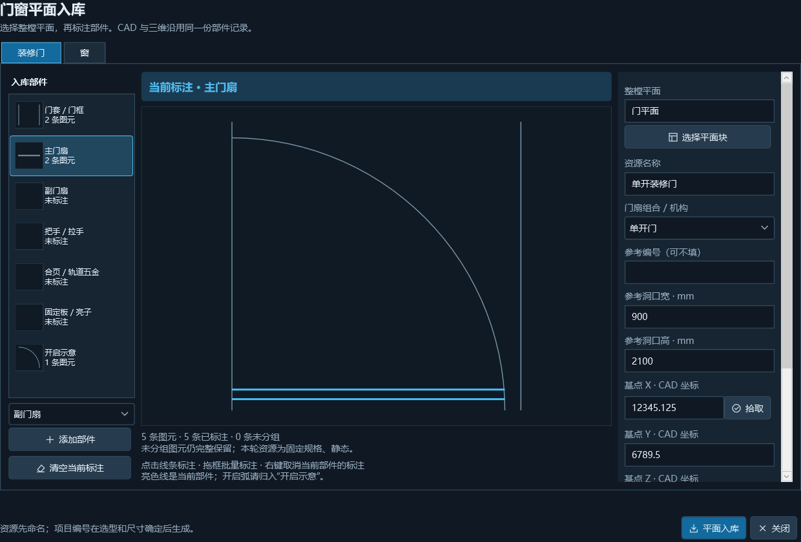
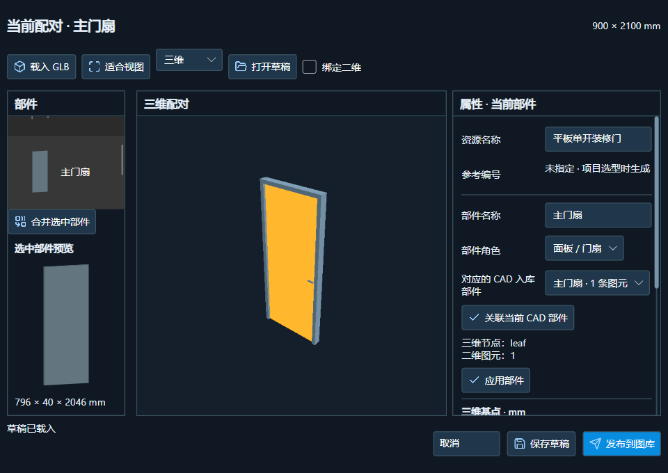
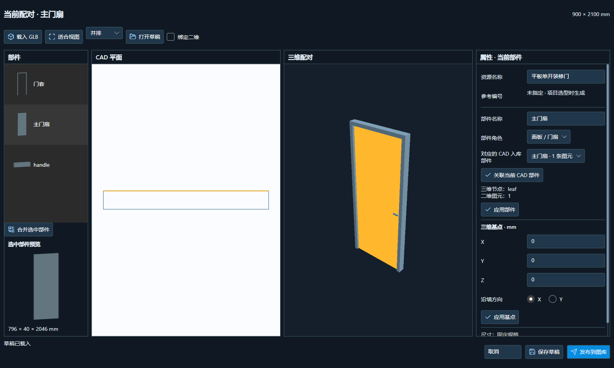

# 装修门部件入库 R0 首批验收

日期：2026-10-07。产品版本保持 1.5.6。源码、AutoCAD 2022 插件和模型程序已编译，以下验证通过；用户确认关闭后，已于 2026-10-07 20:34:46 备份并覆盖原安装。未上传 GitHub。

## 用户操作

1. CAD 图库 → 平面入库 → 装修门，选择整个原生 CAD 门块，输入资源名称、参考洞口宽高及基点／方向／单位。资源编号可留空。
2. 左侧选择“门套／门框”“主门扇”“副门扇”“把手／拉手”“合页／轨道五金”“固定板／亮子”“开启示意”或添加其他部件。中间顶部明确显示当前标注部件。
3. 在实际平面预览点选或框选图元，当前部件高亮；右键移除归属，左侧缩略图和数量同步。空部件显示“未标注”，没有虚构缩略图。同一图元不能同时归属两个部件。
4. 直接入共享图库；模型图库显示同一条资源，只需补充 GLB。多个三维节点可多选合并为一个门套／门扇，再关联对应的整组 CAD 部件。顶部始终显示当前配对部件，三维与平面同步高亮。
5. 保存草稿或发布到同一资源。取消整组关联会释放原二维图元；“开启示意”不能关联三维实体。

CAD 预览刷新后若改变基点／方向／单位，要求重新刷新；保存前重新原生提取并检查几何哈希，避免 CAD 已改而标注仍指向旧图元。不同块不会静默继承旧分组。

## 数据与兼容

- 平面 schema 3 用于装修门，保存组合分类及带 GUID 的部件；每个部件记录原生图元索引。资源 ID、CAD 部件 ID、三维部件 ID 和项目编号各自独立。
- 三维 `PlanPartId` 指向同一 CAD 部件，验证来源、全组索引与唯一归属。GLB 节点名不自动推断语义，用户明确配对。
- 资源编号为空时以名称显示和检索。当前 CAD 按参考规格插入时生成 `M0921` 等参考编号，不回写资源编号；项目选型／尺寸确定后的正式编号生命周期仍在后续阶段实现。
- 旧 schema 1 门窗、schema 2 家具、v1 参数资源和 v2 静态模型继续读取；旧平面序列化样本逐字节及 SHA-256 不变，不触发无意义的共享库失效。
- 共享目录、原子保存、乐观并发、不可变修订、平面更新复核和项目资源副本继续沿用原机制。

## 验证证据

| 验证 | 结果 |
|---|---|
| ComponentPackages | 空编号、稳定部件、同名不同资源身份、门套多节点配对、非法索引／重复归属／开启弧拒绝、发布／重开／草稿通过 |
| ComponentSources、ComponentAssets | 原生符号与 GLB、哈希、限额、来源不变及资源包回归通过 |
| BuildingModel | 旧门窗尺寸、开启、图库、撤销、保存、镜像、斜墙及平面图示回归通过 |
| WPF 实际窗口 | 960×680、1240×840、1600×960；空编号、标注／取消、拾取取消保留值、坐标刷新、滚动和底栏边界通过 |
| Avalonia 实际窗口／GPU | 960×680、1600×960；同步共享库、真实网格／缩略图、合并门套、配对／解除、草稿、重开及项目／来源不变通过 |
| AutoCAD 2022 Core Console | `CAD_COMPONENT_SOURCE_NATIVE_OK`，含 `decorationParts optionalCode`；`CAD_COMPONENT_LIBRARY_OK`，含 `decorationReferenceCode` |
| Release | 官方 Build-Release 入口编译 R24 2022、启动器和模型程序；0 错误，保留既有 Avalonia 分析器版本及 Bitmap 过时警告 |

CAD 原生测试只用复制模板和临时 side database；Core Console 退出时报告自己的临时文件清理失败，两项 QA 成功标记均已输出，未使用用户 DWG。

原始日志、测试资源和发布产物保留在本机 `.artifacts`／`dist`，不随 Git 上传。测试门为程序生成的简单门套、门扇和把手网格，未冒充 Max 实机导出验收。

最终暂存安装包也通过实际模型窗口及 CAD 原生 QA；构建路径为 `dist/WanLuoArchitectureTools-decoration-r0-20261007`，现已覆盖原目录并完成安装后自测。该批 SHA-256：

- R24 DLL：`FBBACBA063FD430857A8D9F35D354639E6562D40B0A4215D98F34193A1A73FB2`
- 模型 DLL：`8BE87C4106B18D8086F0CE0355301BB6133E3328CE2E59E2D142A3A7B850C04D`
- Core DLL：`4A79346E0C2F4FB81CEC093AD3C1EA4DAAC41DF4C33D09317383C52673C38BAE`
- 旧平面回归样本：`1472867E4C12F490260A22D0AE289EAFFE71C666EA4B1325119E5458A2E2A00C`

## 安装结果

用户本轮回复“已关闭”；安装前复查无 CAD／模型／启动器进程，逐文件独占打开检查通过。覆盖原 `dist/WanLuoArchitectureTools`，119 个安装文件 SHA-256 与验证包一致，其中替换 7 文件；3 个用户配置文件哈希不变。既有被替换文件备份在 `.artifacts/install-backup-decoration-r0-20261007`。

原安装模型程序实际窗口／GPU 自测通过：`COMPONENT_PACKAGE_UI_OK`、`AVALONIA_GPU_PICK_OK`；测试仅用隔离样本，不改用户工程或图库。版本保持 1.5.6，R24 对应 AutoCAD 2022；本轮未更新 R25。

## 实际界面

## 下一阶段与边界

本批完成 R0 的入库／标注／配对基础，不是全部装修门功能。单开、双开、子母、推拉、折叠等选项目前是分类元数据；没有因此解锁可变规格、轨道、铰链或开闭。

R1 先完成固定装修门关联已有建筑洞口并形成正式实例，确保不重复切墙和计数、保存／撤销／CAD／GLB 输出一致；随后实现单开门套＋扇＋把手／合页的尺寸规则和动作。双开／子母及推拉等按后续阶段逐项验收。外部资源仍标明“固定规格／静态”；材质与实际门型样本库尚待扩展。
