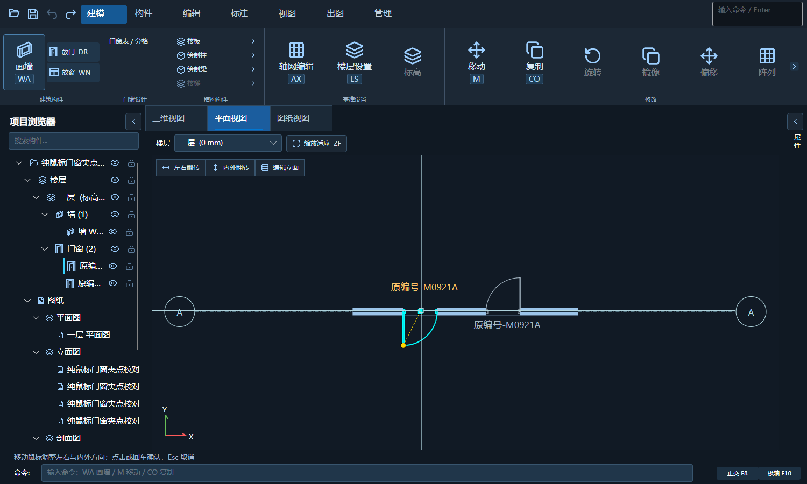
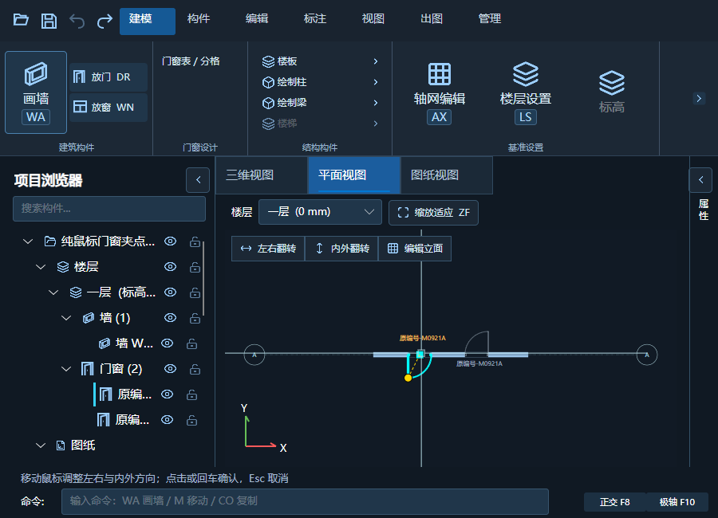
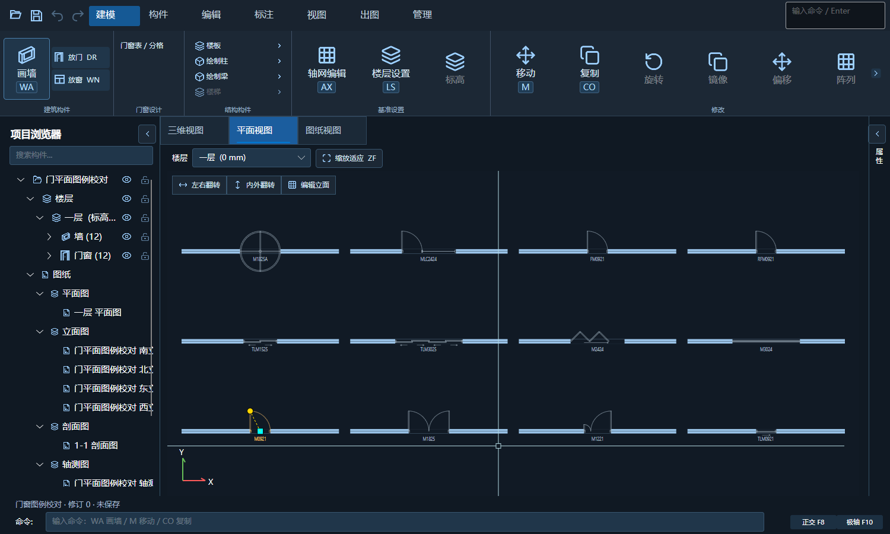
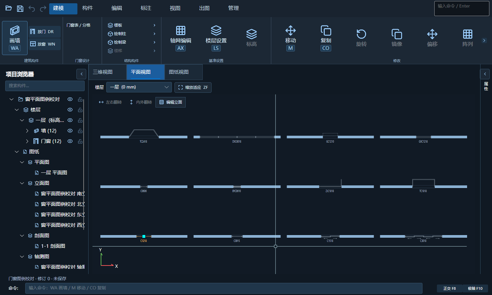
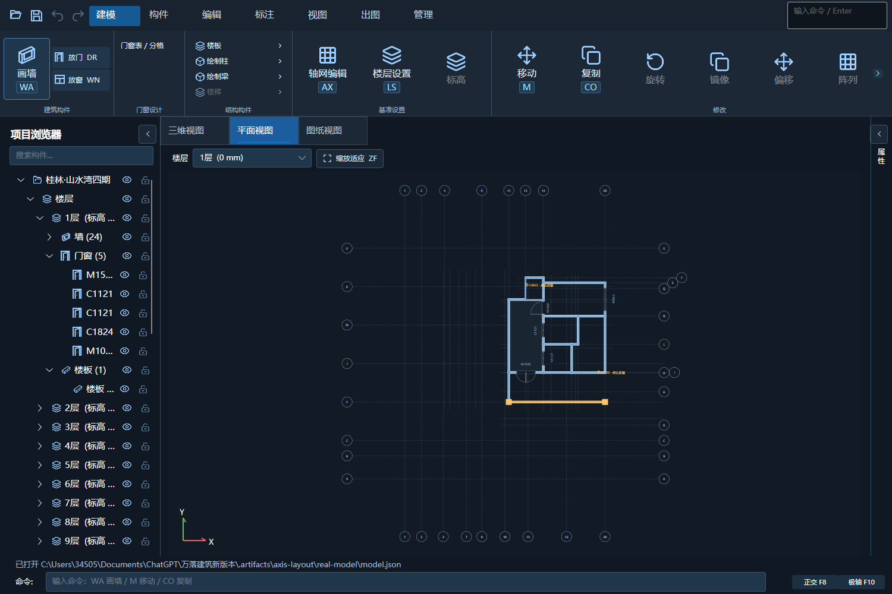

# 门窗图例与纯鼠标夹点自测

设计基准：`docs/designs/door-window-plan-20261003/` 内用户确认的三张图。程序版本保持 1.5.6，未新建另一套安装目录。此记录覆盖本轮平面图例、编号、实例方向及点击夹点流程，不替代 CAD 实机落图与 Windows DPI 验收。

## 实现

- 新增共享 `OpeningPlanGeometry`，按现有立面分格生成每扇平开弧、框料、玻璃、推拉轨道、搭接和箭头。普通编号不强制画平开，门联窗只给门区画弧。
- 类型新增 `PlanStyle`、`PlanReturnInset`，支持特殊门和平面凸窗形状，编辑窗口读写、模板复制与 JSON 往返均保留。
- 编号读取原门窗编号，平面编辑与图纸/CAD 共用标签位置规则；字高/宽度因子沿用注释配置。
- 高窗不再强制开断墙，以墙侧虚线投影表示。窗台、模型坐标和实际洞口尺寸不因平面表达修改。
- 方形位置点在洞口中点；平开圆点在扇自由端。点后松开保持草稿，移动预览后点击、回车或空格验证提交，Esc 取消。
- 左右和内外判断使用墙局部坐标，以初始铰链为基准，设置四像素中线死区。近距离夹点按最近距离命中；主动释放捕获与异常失去捕获分别处理。
- 墙交接与局部图例保留缓存；新增编号排版缓存。位置移动不逐帧重新生成门窗或三维，确认后才刷新模型。
- 视口左上角相连的三项命令使用统一 32 px 高度和现有图标，固定构件禁用翻转。小窗口不通过裁掉末尾按钮来缩短工具条。

## 测试结果

| 验证 | 结果 |
| --- | --- |
| 纯逻辑完整回归 | `BatchPdfPublisher.BuildingModel.Tests` 通过，含新增 24 类图例、实际格宽半径、框轨、原编号、镜像、转墙变换、高窗及类型保存 |
| CAD 登记逻辑 | `BatchPdfPublisher.CadOpeningRegistration.Tests` 通过，登记、识别、待定位、标准层、门窗表及安全重新导入保留 |
| 常规窗口 | 发布程序 `--smoke --opening-plan-check`，1500×900，通过 |
| 小窗口 | 发布程序 `--smoke --opening-plan-check --snapshot-size 900x650`，通过，工具条边界和按钮 32 px 高度检查通过 |
| 实际指针事件 | 点击松开、无按键移动、二次点击、回车、空格、Esc、无效位置修正、一次撤销、同编号实例隔离、捕获丢失、右铰链四象限、斜墙和中线死区通过 |
| 移动缓存 | 连续 240 次指针移动不增加局部几何重建数，事件处理约 1～2 ms；不是 240 帧绘制耗时或整栋 FPS |
| 原有拖动及轴网 | `--smoke --axis-check` 通过，位置拖动、方向拖动、撤销以及原轴网批量操作通过 |
| 图纸 | `--smoke --drawing-check` 通过，图种、目录、预览、比例、文字设置和撤销重做保留 |
| 门窗做法编辑 | `--smoke --opening-editor-check` 通过，多选、构造、局部三维预览、应用及撤销重做保留 |
| 真实项目副本 | 打开 `.artifacts/axis-layout/real-model/model.json` 截取平面，渲染和 GPU 拾取通过；未改 H 盘原项目 |
| 编译 | R24、R25、Avalonia 自包含发布通过；Avalonia 保留原有两个分析器版本警告及一个 Bitmap.Save 过时警告 |

## 运行截图

这些是程序运行截图，不是生成的设计图。图例校对模型显示实际毫米尺寸，未为对照图片拉伸几何。

## 范围边界

- 新增折叠、卷帘、旋转及转角/梯形凸窗是平面类型和符号。专用机械三维构造、转角跨墙开洞不是本轮已完成项，不能用平面截图声称完整三维已验收。
- 尚未进行本轮 CAD 实机 NETLOAD/落图测试、125%/150% Windows 缩放及跨屏测试。
- 本轮没有上传 GitHub。

## 原目录安装验证

- 用户本轮确认“我关好CAD了”，覆盖前再次检查，AutoCAD 与建筑模型进程均不存在。
- 2026-10-04 11:14:40 +08:00 已覆盖原 R24 插件及建筑模型目录，保持产品版本 1.5.6；R25 仅编译，不部署。
- 覆盖前备份至 `.artifacts/install-backup-opening-symbols-20261004-111440`，包含原 R24、模型程序及 build-info.json。没有删除原目录中发布源之外的用户配置。
- R24 的 24 个文件、模型程序的 224 个文件逐一 SHA256 核对一致，不部署 PDB。
- R24 插件 SHA256：`DC59AA036DF091F2244F151D98AAAC204AA8AF14D5B20A5CF4CECEE2A7559A04`。
- 模型实现 DLL SHA256：`D1BBC9275E112CD69B1BB542BF316EBE31453D513D6D8DAAE43FAF8152CE7BF6`。
- 使用原安装目录内 DLL 运行 `--smoke --opening-plan-check`，1500×900 与 900×650 均退出 0，实际指针事件、方向状态、撤销及 GPU 拾取通过。
- 原安装目录程序 `--smoke --drawing-check` 退出 0，图种、目录、增删复制、实时预览、比例、文字设置及撤销重做通过。
- 上述安装版窗口自测不代表 CAD 实机 NETLOAD/落图或 Windows 跨屏缩放验收。
