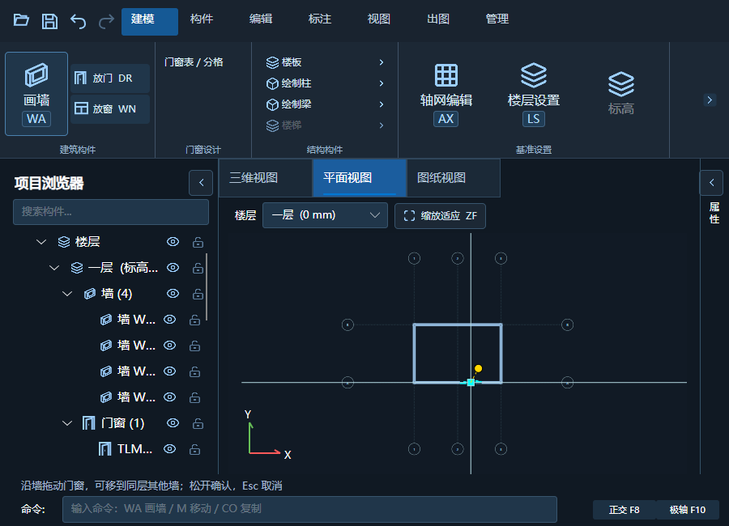
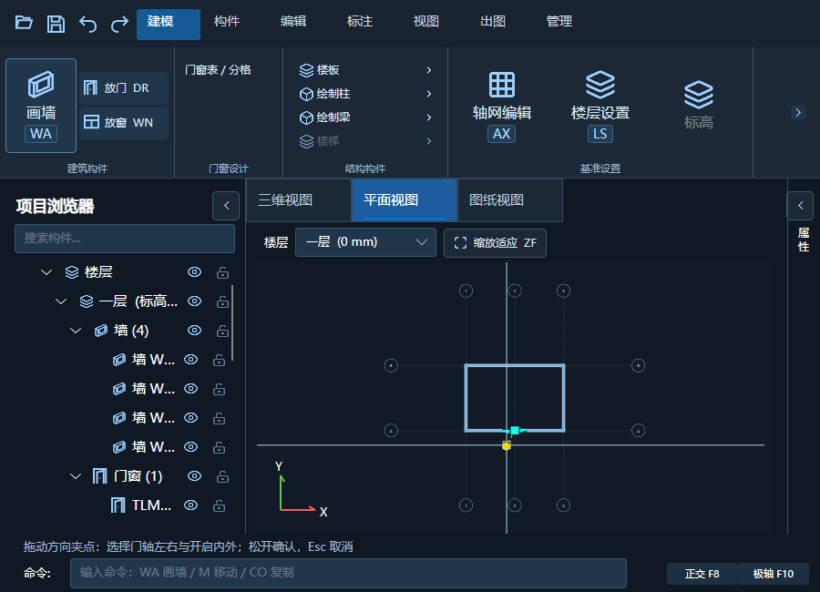

# 门窗夹点与移动预览

## 原因与修复

- 平面视口的旧图例缓存未传入模型保存的立面类型；普通门又走整宽单扇平开分支。现改为读取共享类型和单樘覆盖，按立面各格的平开、推拉或固定方式绘制。1800 mm 双扇测试每扇开启半径为 900 mm，不再画整宽弧。
- 平面选中已关联的门窗，青色方形夹点移动位置，可换到同层其他墙；门的金色圆形夹点调整左右及内外方向。实例方向保存于 PlanFlipAlong、PlanFlipNormal，不修改共享类型；图纸投影也读取相同状态。
- 夹点拖动阶段只更新局部草稿。松开后验证并提交一次，Esc 或失去捕获取消；越墙端、跨楼层及无效坐标不提交。提交后才刷新三维。
- 局部门窗图例缓存按类型、宽高、窗台高、墙厚与方向区分，移动仅做坐标变换。墙交接缝改为模型刷新时缓存，避免每帧计算。

## 验证记录

- 核心建筑模型回归通过，包括普通双扇、普通编号配推拉做法、方向镜像、保存、标准层继承、换宿主、跨层拒绝、非法输入回滚与撤销。
- CAD 登记回归通过，R24、R25 及模型程序编译成功。版本保持 1.5.6，产物位于 `.artifacts/opening-grips`。
- 1500×900 与 900×650 实际窗口指针测试通过：方形夹点移动、圆形夹点方向、释放提交、Esc 取消、一次撤销。连续移动 12 次确认预览几何生成计数不增长；不是复杂整栋帧率测量。
- 图纸窗口自动检查通过，包括出图种类、实时预览、比例及文字设置的应用、取消、撤销和重做。
- 用户原始模型未改动。操作入口仍在平面视口，不是三维透视直接拖拽；三维门窗保持闭合实体表达。
- 尚未进行 CAD 实机落图和 Windows 多显示器 DPI 验证。
- 用户再次确认关闭后，21:22 检查 CAD 与模型进程均已退出，备份至 `.artifacts/install-backup-opening-grips-20261003-212248`，覆盖原 R24 与建筑模型目录，248 个文件逐一 SHA256 一致；版本保持 1.5.6，未新增安装版本或覆盖 R25。

