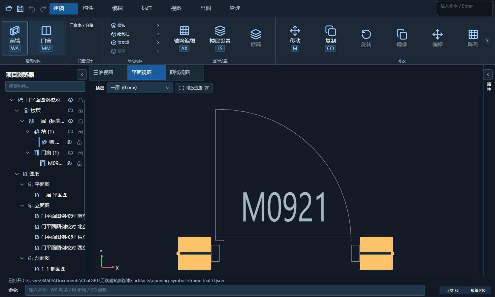
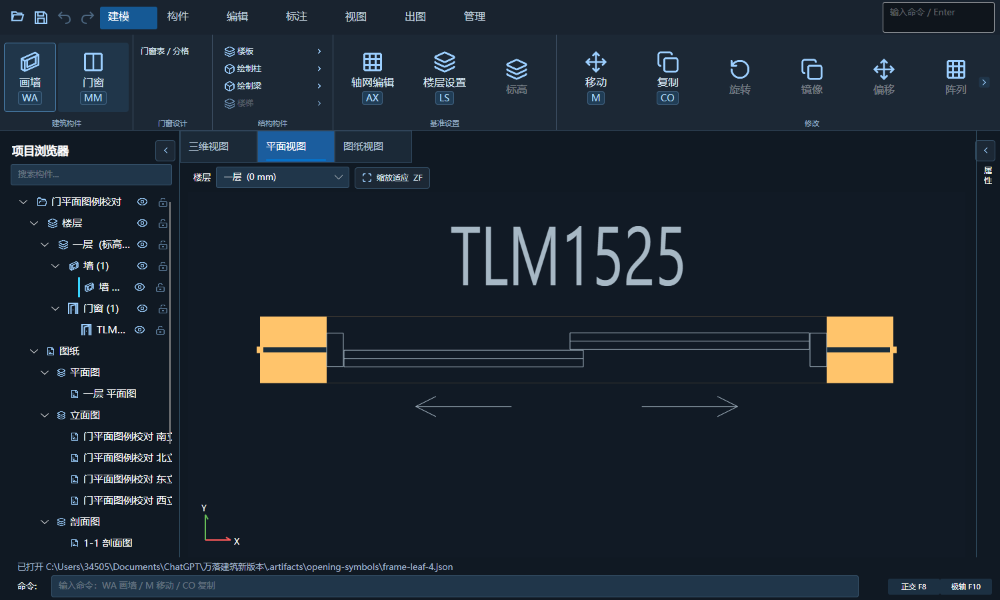

# 门窗平面框扇分离

## 问题与修正

用户局部截图中，推拉扇端部穿进固定边框，平开扇铰接处叠在框线上。平面生成器使用原始分格宽度而非净扇边界，并再次叠加了已在构造中计算过的推拉搭接；模型平面的 15 mm 几何线宽又随放大增粗，进一步盖住间隙。

- 按当前剖切高度读取构造扇的净边界、厚度和轨道，固定边框内保留对应扇缝。
- 平开符号的铰接位置避开固定框，轮廓、开启弧、自由端夹点和预选扇形同步；保持实例角度及两种翻转。
- 推拉不再重复加搭接；有固定中梃时以净空限制轮廓，无中梃时保留实际双轨搭接。
- 固定、平开窗及悬窗仍按剖切构造表示，不新增门式开启弧。门联窗继续分门区、窗区。
- 模型平面门窗线宽改为固定 1 个逻辑像素；真实尺寸、三维构造、编号、门槛和 CAD 图层线宽不变。

## 放大运行校对

截图来自当前编译产物的 Avalonia 实际窗口，不是设计生成图。橙色为已选中宿主墙，两侧固定框、扇及开启符号可分别辨认。

## 验证

- 核心投影测试全部通过：单扇、双扇、子母、推拉及门联窗；0/15/30/45/90/120/180°，独立左右/内外翻转及三种安装靠位。沿符号线段采样检查不得进入固定框内部；验证无中梃搭接只计算一次、模型序列化数据及三维构造不变。
- CAD 登记测试通过，R24 编译无警告/错误，R25 编译无警告/错误。模型程序编译仍有两项现存分析器版本警告及一项现存 Bitmap.Save 过时警告。
- 实际窗口交互回归覆盖 1500×900 与 900×650：方向/位置/编号夹点、松手提交、四象限、预选、数字净距、右键居中、MM 类型与模板、角度/编号编辑及撤销。独立参数预览检查通过。
- 桂林·山水湾四期真实模型只读回归：15 层、138 个源门窗、285718 个三维面。门槛输入 58.6 ms、预览 725.0 ms、应用 64.6 ms、取消 5.1 ms；方向提交 458.4 ms、移动提交 958.6 ms，包含 10 个标准层实例，增量面与全量重建一致且可撤销。性能测量在本机完成，不等于其他机器帧率保证。
- 原项目文件没有保存或覆盖；真实模型回归使用内存副本。窗口尺寸测试不替代 Windows 125%/150% 跨屏测试；没有把 CAD 实机落图或打印复核写成通过。

## 部署

用户确认关闭后，2026-10-04 22:19（北京时间）已覆盖 `dist/WanLuoArchitectureTools` 的模型程序及 R24 插件，仍是 1.5.6。覆盖前再次检查 CAD、模型程序及 dotnet 模型进程均未运行；224 个模型程序文件及 24 个 R24 文件逐一核对哈希。构建产物在 `.artifacts/opening-plan-clearance`，首次覆盖前的旧版备份在 `.artifacts/install-backup-opening-plan-clearance-20261004-220835`，补充横框剖切的空净宽保护前备份在 `.artifacts/install-backup-opening-plan-clearance-final-20261004-221905`。两处均为内部备份，不是新增安装版本。

- R24：`AA21FADE6B8BBAE05C163253B530299F276D1990EDCB9A665B2EE019496FFB1E`
- 模型运行 DLL：`75A23EFFE395B2FD7301EC4071FD1B27A88E70C185C1381135A61A868FF644A5`
- 模型核心 DLL：`67D2A5F2B35716F9A3FDCF4D41D20FED292789757A94D3D1A53CA90C48EEB8AA`

横框正好穿过剖切高度且无有效扇净宽时，不绘制负半径扇形或方向夹点。R25 仅编译验证，当前安装清单只有 R24，未擅自新增安装 band。原山水湾模型 SHA256 仍为 `86C27A5D97DDF188DA4D71B2AA2DEDCEC03DD099A94D1786D3C831AE7D4B051B`。

最终安装目录运行 900×650 交互检查通过：OPENING_CENTER_OK、OPENING_EDIT_OK、OPENING_MOUSE_OK、OPENING_PRESENTATION_OK、WALL_PREVIEW_OK、OPENING_PICKER_OK 及 GPU 拾取检查，退出码 0。
