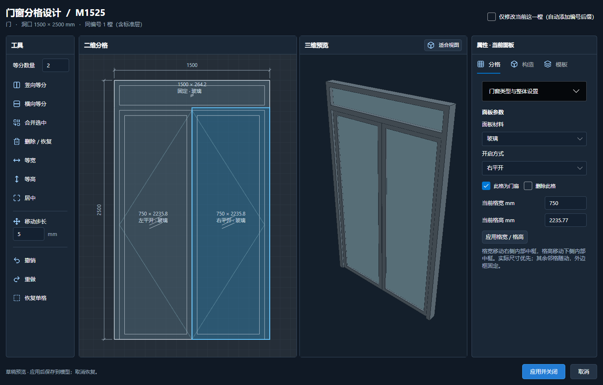
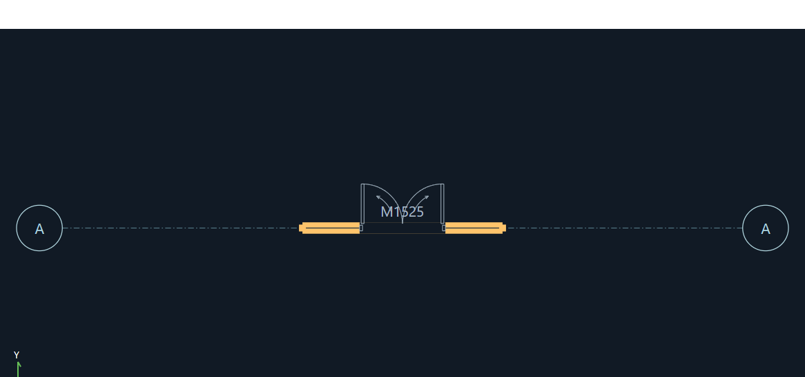

# 门窗立面与平面开启对应核对

日期：2026-10-05。用户以 M1525 的双扇门加固定上亮截图反馈开启表达不一致，随后明确：合页在两侧外框，立面开启折线尖端均指向合页。

## 原因与修正

1. 旧立面尖端指向自由端，而平面按实际合页旋转。这不是要把平面翻反；统一改立面折线：左/右平开尖端指向对应侧合页，上/下悬指向对应铰接边，中悬的两组三角尖端指向中轴。固定格不画开启线，推拉箭头表达滑动方向。正背立面镜像沿用同一实际合页坐标。
2. 通用“双扇平开”的立面曾用中间合页，平面和三维又没有统一解析该通用值。现在先在共享分格几何解析成左扇左合页、右扇右合页，立面、平面、三维和方向夹点/预选使用同一数据。明确逐格参数仍保留，不擅自重写用户模型。
3. 分格编辑的立面和三维使用草稿，但主平面没有收到预览，造成新旧做法并排。现在草稿同步主平面，应用才提交，取消恢复正式模型与原符号，并隔离过期异步任务。
4. 旧自定义格没有内嵌开启值时，优先读取数量匹配的 CellOpeningModes；不再被整体开启值提前覆盖。

说明：其他软件支持开启线尖端指向把手或合页两种约定，本项目以本次用户确认为准，不将旧代码约定说成唯一标准。参考 [Graphisoft 官方开启线方向设置](https://support.graphisoft.com/hc/en-us/articles/30483887446801-How-to-mirror-opening-line-of-Doors-and-Windows)。

## 验证

- 完整建筑模型核心测试与 CAD 楼层登记测试通过。
- 新增门/窗左、右、上、下、中悬尖端几何测试；更新南北立面、门联窗与 1:50/1:100 精确坐标断言。
- 通用双扇与明确逐格定义在 15/30/45/90 度、独立左右/内外翻转下，平面、三维、自由端夹点及预选一致。固定上亮不成为门扇。
- M1525 1500 x 2500、双扇各 750 x 2235.77 加固定上亮的实际窗口截图，左右尖端分别指向两侧外框；常规和紧凑窗口、草稿切换、应用撤销重做及取消恢复检查通过。
- 山水湾 M1525 实模的草稿同步与取消恢复通过，运行前后文件 SHA256 均为 `A21B99F15D44B81A19BDD801288E908D517B5947C56ACC982289DBD866C503FF`，未保存或更改用户文件。该实模检查在尖端统一前执行，最终尖端规则由独立几何与 M1525 窗口复测覆盖。
- 图纸线宽内收、墙交接辅助斜线隐藏及门窗夹点交互回归通过。CAD 实机落图/打印及多屏 DPI 未在本轮重测。

## 安装

模型程序、R24、R25 均编译成功。2026-10-05 17:19:34 确认 CAD/模型进程关闭后，覆盖原 `dist/WanLuoArchitectureTools/建筑模型` 与 `CadApi/R24`，保持 1.5.6；224 个模型程序文件、24 个 R24 文件逐个校验。R25 仅编译，未安装。

- 备份：`.artifacts/install-backup-opening-hinge-20261005-171932`
- R24：`BE8FCC393339378426EFF2459CD0C18C810425D493ADA81004FF9A230D2B6260`
- 模型运行库：`3EF58147187B9D5E95B4783A465843A8358AE6CF8161192CCA5574229EDD4944`
- 核心库：`787C63B321A901C3E7F992C12A2221631E76332AE4073BF46D58BC2107850689`

本轮未提交/推送 GitHub。不要把用户模型、DWG、SDK 或安装备份上传；测试截图仅保留独立 M1525 样例。

安装后 M1525 编辑检查及 900 x 650 门窗夹点/居中/MM/墙预选回归通过。

