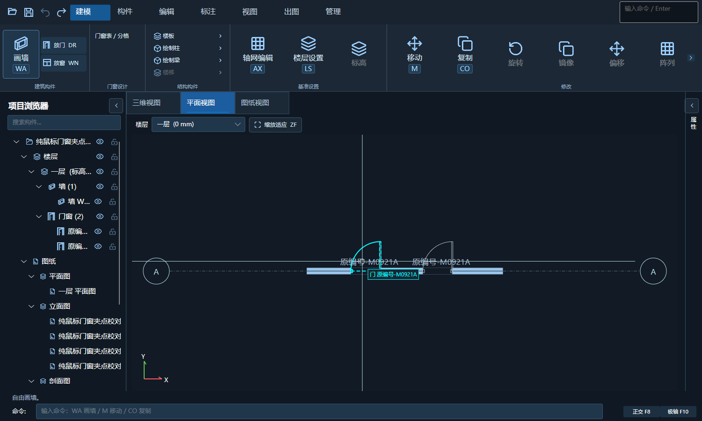
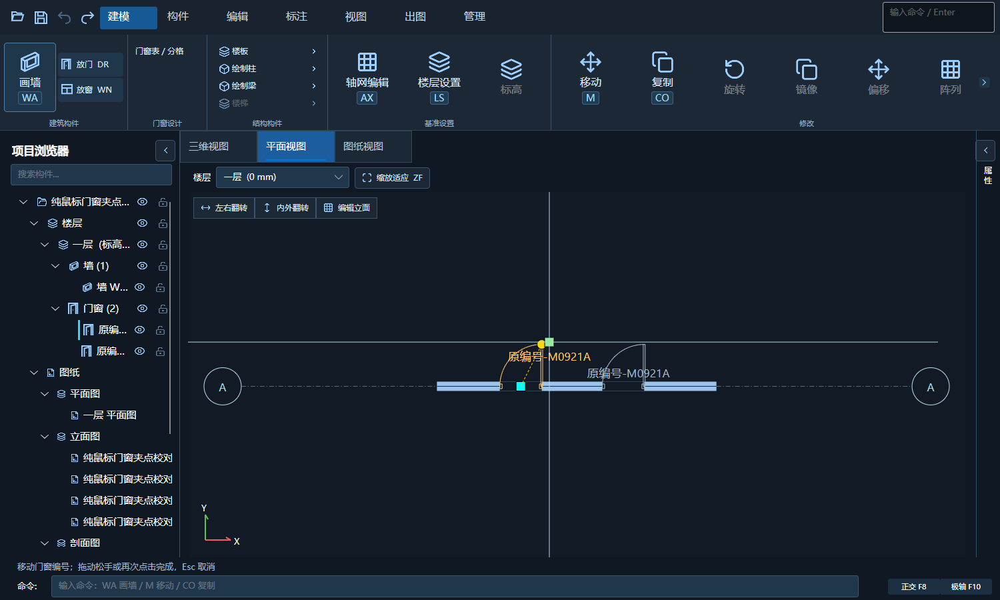
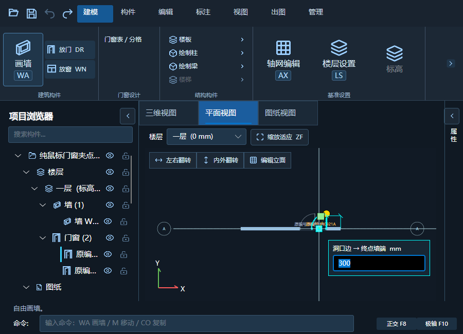
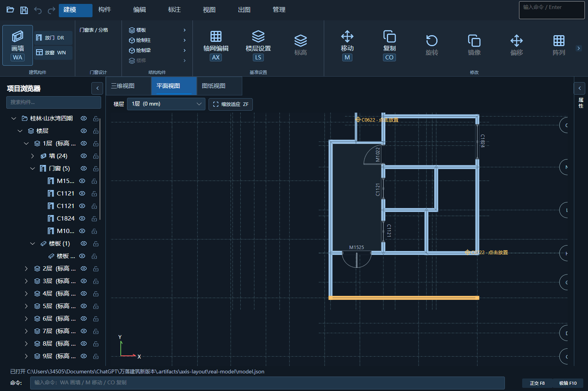

# 门窗编号、拾取与墙端净距自测

## 本轮要求

- 编号默认贴近洞口外沿，不为开启符号预留大空白；允许与扇/弧相交，不盖住洞口。
- 绿色编号夹点独立移动文字，方形位置夹点和圆形方向夹点保留；可见尺寸 14 px、命中半径 14 px，接近时取最近点。
- 拖动松手直接提交最终释放位置；点击松开后移动、再次点击入口也保留。不要求 Shift 或额外空格/回车。数字净距输入用回车确认数值。
- 平面门扇、弧、开启区域、框及洞口参与拾取；悬停预选与点选共用判断。新增明确的夹点悬停提示。
- 位置移动显示洞口边到最近宿主墙端的净距，界线和字段明确起点/终点。输入期间固定参照，按沿墙坐标换算，不用屏幕距离。

## 数据与边界

- 编号实例增加沿墙/法向毫米位移，旧文件默认 0。位置移动和编号移动为独立事务，一次撤销恢复。
- 保存、墙复制、标准层展开和 CAD 安全重新导入均保留编号位移；原编号及同编号其他实例不受影响。
- 图纸投影和 CAD 输出共用贴边位置，采用当前图纸字高与字宽设置。比例或字高变化时仍约束在洞口外。
- 开启区域采用实际门扇分格的四分之一圆区域，不以整个包围矩形代替。框线、开启弧及编号也可拾取。
- 净距的“墙端”是当前宿主墙起点/终点，不是全建筑包围盒或附近任意墙。未关联的 CAD 参考门窗仍保留原定位流程。
- 本轮预选和编号夹点位于平面编辑视口；图纸预览接收编号位移，不声称增加了图纸视口夹点编辑或三维悬停预选。
- 延续局部图例缓存，预览不逐帧重建三维；净距框在视口内限位。窗口尺寸测试不代表 Windows DPI 或跨屏实测。

## 验证

- 纯逻辑回归通过：贴边编号、反向/竖墙、保存、墙复制、标准层、无效坐标、一次撤销、文字参数及墙端净距换算。
- CAD 登记回归通过，新增重新登记保留编号位移断言。
- 实际窗口事件测试通过：框/弧/门扇/开启区域预选，弧外空白不误选，预选与点选一致；拖动松手使用最终位置；独立编号编辑与取消；净距两端、斜墙、无效值修正、一次撤销、同编号实例隔离。
- 1500×900、900×650 窗口测试与边界检查通过；保留原四象限、中线死区、失去捕获及点击松开工作流回归。
- 原轴网与门窗拖动回归、图纸种类/目录/比例/文字设置回归通过。
- 真实项目使用 `.artifacts/axis-layout/real-model/model.json` 副本，不修改 H 盘用户原项目。
- R24 使用本机现有 .NET Framework 4.8.1 引用程序集，R25 仅编译；模型程序自包含发布。Avalonia 原有两个分析器警告及 Bitmap.Save 过时警告保留。
- 尚未执行本轮 CAD 实机 NETLOAD/落图及 125%/150% Windows 缩放、跨屏测试。本轮未上传 GitHub。

## 原目录安装

- 用户已授权直接覆盖，随后确认“关好了”。覆盖前检测 AutoCAD 和独立建筑模型进程均已退出，没有强制结束进程或放弃未保存修改。
- 2026-10-04 14:19:00 +08:00 已覆盖原 R24 插件和建筑模型目录，保持 1.5.6；R25 只编译不部署，未增加安装版本。
- 原 R24、建筑模型目录和 build-info.json 备份至 `.artifacts/install-backup-opening-edit-20261004-141900`。
- R24 24 个文件、模型程序 224 个文件全部逐一 SHA256 核对一致。不部署 PDB，不删除发布源之外的用户配置。
- 插件 SHA256：`80613AC7E58EE12FF8E644C11243FED400AD80B48953145B42A6C8C43B6C61D5`。
- 模型实现 DLL SHA256：`9B01A20647FC39B718FA6DFBF93799C451A78CE4E883CDFF47834E8FBEC42BE2`。
- 模型核心 DLL SHA256：`51C8413DC8F77B7B2A1197C077892B96680A4E5CF81A9155A7F0AF982CFA67C1`。
- 首次安装版运行提前退出且无自测日志，不计为通过。随后使用原安装目录 DLL 重跑 1500×900、900×650 的 `--smoke --opening-plan-check`，均退出 0 且返回 `OPENING_EDIT_OK`、`OPENING_MOUSE_OK`、GPU 拾取通过日志。
- 原安装目录 `--smoke --drawing-check` 退出 0，图种、目录、预览、比例、文字设置及撤销重做通过。自测窗口已正常退出。
- 安装版窗口自测不代表 AutoCAD 实机加载/落图或 Windows 多显示器 DPI 验收。

## 运行截图

以下为实际窗口自测截图，不是生成的设计图。

